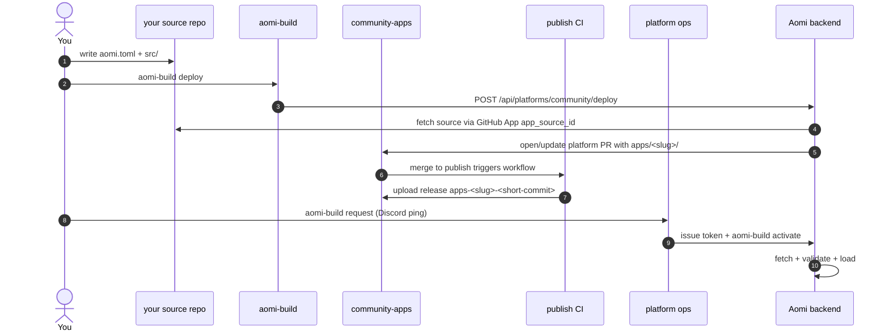

# Launching an Aomi App

End-to-end guide for shipping a new app into community-apps and getting it loaded on the Aomi runtime.

1. **Author** your app in your own source repo: a Rust `cdylib` crate + `aomi.toml`.
2. **Deploy** with `aomi-build deploy` — sends a source-bound request to the backend.
3. **Platform PR + CI** — the backend copies source into this repo, opens or updates a platform PR, and the `publish` workflow builds a GitHub release tagged `apps-<slug>-<short-commit>` after merge.
4. **Request onboarding + activation** with `aomi-build request` if you need source access or an activation token. Once CI's release exists, `aomi-build activate` fetches + loads it.



---

## Prerequisites

- **Rust nightly** (the SDK builds on `2024` edition)
- **`git`** on `PATH` — `aomi-build` uses it to resolve local source refs
- **`gh` (GitHub CLI)** logged into an account with read access to `aomi-labs`.
  It is still useful for opening PRs and checking GitHub status directly.
- **`aomi-build`** — the deploy CLI, shipped from the SDK:

  ```bash
  cargo install --git https://github.com/aomi-labs/aomi-sdk --features cli aomi-sdk
  # binary lands at ~/.cargo/bin/aomi-build
  ```
- **Connected source repo** — install the Aomi GitHub App on your source repo
  and get the resulting `app_source_id`. `aomi-build deploy` sends this id to
  the backend with `--app-source-id` or `AOMI_APP_SOURCE_ID`.
- **Backend credentials** — real deploy and activate calls need a backend URL
  and activation token. Use `aomi-build request` if you need ops to issue one.

You can still run an offline dry-run without credentials; the real backend
deploy requires the credentials above.

---

## 1. Author your app in a source repo

Your app lives in its own repo, separate from this one. The minimum layout:

```
my-cool-app/
├── aomi.toml
├── Cargo.toml
├── .gitignore       (must include .aomi/, target/, and Cargo.lock)
└── src/
    └── lib.rs       (#[no_mangle] aomi_plugin_entry via dyn_aomi_app! macro)
```

### `aomi.toml`

```toml
[app]
name         = "my-cool-app"            # slug — kebab-case, becomes the release tag
display_name = "My Cool App"            # human-readable
platform     = "community"              # MUST be "community" for this repo
git          = "https://github.com/aomi-labs/community-apps"
public       = true                     # visible to all backend users

# Optional: pin which class of backend can load this release.
# Omit to default to ["staging"] — your release will only load on staging
# backends. Set to ["prod"] for the production-tier release once tested.
# server_tags = ["staging"]
```

#### Source access

Do not put GitHub tokens in `aomi.toml`. Hosted deploys are source-bound:

- The Aomi GitHub App installation creates an `app_source` row for your source repo.
- `aomi-build deploy --app-source-id <id>` tells the backend which connected source to read.
- The backend mints short-lived GitHub App tokens server-side for source reads and platform writes.

For community apps, `aomi.toml` should describe the app and target platform;
source repo credentials stay outside the app manifest.

### `Cargo.toml`

Pin the SDK to the exact version this repo's CI expects. Check `platform.json`
in this repo for the current `required_sdk_version`:

```toml
[package]
name = "my-cool-app"
version = "0.1.0"
edition = "2024"

[lib]
crate-type = ["cdylib"]

[dependencies]
aomi-sdk   = "=3.0.0"          # match platform.json's required_sdk_version
serde      = { version = "1", features = ["derive"] }
serde_json = "1"
```

> **Heads up:** `aomi-ext` (the optional HMAC / signing helpers) is not yet
> published to crates.io. If you need it, copy the small helpers you use into
> your `src/auth.rs` directly. See `apps/gambit/src/auth.rs` in this repo for
> an example.

### `src/lib.rs`

Register your tools with the `dyn_aomi_app!` macro at the bottom of `lib.rs`.
Look at any existing app under `apps/` for the shape — `apps/fanforge` is the
cleanest reference.

---

## 2. Sanity check: build + dry-run

```bash
# from your source repo:
cargo check                    # ensure your plugin compiles
cargo test                     # if you have any tests
```

Then dry-run against staging. Dry-run does the offline plan **and** the online
preflight (backend reachability, branch contract, server-tag subset check) —
it's the single "show me what would happen" command:

```bash
AOMI_BACKEND_URL=https://staging-api.aomi.dev \
  AOMI_APP_SOURCE_ID=<your-app-source-id> \
  aomi-build deploy --platform community --dry-run
```

With backend credentials, dry-run posts `dry_run: true` and validates source
resolution, archive fetch, and manifests without writing this platform repo.
Without credentials it prints the request it would send.

If any stage fails, fix the underlying issue (usually your `aomi.toml`)
before running deploy. Warnings (`[warn]`) are advisory and don't block —
a common one is `git_url_matches_platform` when you're deploying from a fork.

---

## 3. Deploy

From your source repo:

```bash
aomi-build deploy
```

For explicit, repeatable CI/local usage:

```bash
AOMI_BACKEND_URL=https://staging-api.aomi.dev \
  AOMI_APP_SOURCE_ID=<your-app-source-id> \
  AOMI_APP_ACTIVATION_TOKEN=<platform-or-app-token> \
  aomi-build deploy --platform community
```

`aomi-build` does not clone `community-apps` or push to `publish`. It sends
the repo-scoped deploy request to the backend. The backend reads your source
repo through the GitHub App, stages files under `apps/<slug>/` in the platform
repo, and opens or updates a platform PR.

What this does:

1. Resolves the selected source ref to an exact commit
2. Fetches your source repo archive through the GitHub App
3. Writes `apps/<slug>/` plus `.aomi/deployment.json` in a platform PR
4. After that PR merges to `publish`, the community-apps CI auto-fires:
   - validates the staged source against `apps/<slug>/.aomi/deployment.json`
   - runs `cargo build --release` for the cdylib
   - uploads a release tarball under tag `apps-<slug>-<short-source-commit>`

You can watch CI here:
<https://github.com/aomi-labs/community-apps/actions>

> **`deploy` does not activate.** It creates/updates the platform PR.
> Activation is a separate step that must run *after* CI uploads the release —
> so the platform operator (or you, once you hold a token) runs `aomi-build
> activate` once the release tag exists.

---

## 4. Activation

Once your platform PR is merged, CI is green, and the release tag exists on
GitHub, activate with your scoped token or hand off to the platform operator.

### When is CI done?

Run `aomi-build status` from your source repo. It reads your
`.aomi/deployment.json` and polls GitHub for you, reporting both signals in
one place:

```
$ aomi-build status
Publication status
  repo          : aomi-labs/community-apps
  release_tag   : apps-my-bot-abc1234
  branch        : publish
  local state   : deployed=true activated=false
  ci            : ⏳ running — publish-apps
                  https://github.com/aomi-labs/community-apps/actions/runs/...
  release       : pending (not built yet)
```

When `ci` is green and `release` shows **✓ published … ready to activate**,
you're ready to request activation. (`aomi-build status apps-<slug>-<commit>`
checks a specific tag; otherwise it uses the latest deploy's tag.)

You can still watch the underlying pages directly if you prefer —
`https://github.com/aomi-labs/community-apps/actions` for CI and
`.../releases/tag/apps-<slug>-<short-commit>` for the release — but
`aomi-build status` rolls both up.

### Requesting onboarding + activation

You don't DM ops manually — `aomi-build request` posts the ask for you. Run it
once to get repo access and an activation token (you can do this even before
your first deploy):

```bash
aomi-build request --email you@example.com --git-account your-gh-handle
```

This posts an **onboarding/activation request** — your GitHub account, app, and
email — into the `✅-activation-requests` Discord channel, pinging the **@ops**
role, so asks land in one place instead of scattered DMs. Preview it first
without posting:

```bash
aomi-build request --email you@example.com --git-account your-gh-handle --dry-run
```

An `@ops` member grants your GitHub account access to the platform repo (if
needed) and issues you a release-scoped activation token out-of-band — the
token is **never** part of the request. Once your CI release exists, ops (or
you, with the token) run `aomi-build activate`, then confirm your app at
`aomi-build status --backend https://staging-api.aomi.dev`.

### If you are the operator yourself

Mint a release-pinned token for the tag (ops side: `POST
/api/admin/platforms/community/activation-tokens` with the release tag, or the
equivalent admin CLI), export it, and run from the source repo:

```bash
AOMI_APP_ACTIVATION_TOKEN=<the scoped activation token> \
AOMI_BACKEND_URL=https://staging-api.aomi.dev \
  aomi-build activate
```

That's the whole command. `aomi-build activate` reads `.aomi/deployment.json`
(left there by `aomi-build deploy`) and activates the recorded platform PR,
branch, or commit. The backend derives release tags from the platform
artifact; you normally do not pass `--release-tag`.

For activations that can't see the source repo's `deployment.json` (e.g.
re-activating an older release tag, or running from a fresh machine), every
field can be passed explicitly:

```bash
aomi-build activate apps-<slug>-<short-commit> \
  --backend https://staging-api.aomi.dev \
  --platform community \
  --release-tag apps-<slug>-<short-commit> \
  --target-tag staging
```

…and confirm with `aomi-build status --backend https://staging-api.aomi.dev`.

### How target tags work

`aomi.toml [app].server_tags` is the **build's declared scope** — the set of
backend tiers the contributor signed off on shipping to. `aomi-build deploy`
copies this into `.aomi/deployment.json`, where it travels with the release.

At activate time the operator can **narrow** but cannot **widen**:

- If you declared `server_tags = ["staging"]` in aomi.toml, the operator can
  only activate to staging. An attempt to widen to prod is rejected with a
  multi-line error pointing back at the source repo.
- If you declared `server_tags = ["staging", "prod"]`, the operator can
  activate to either (or both). They'll typically start with `--target-tag
  staging`, verify, then re-run with `--target-tag prod`.

This makes the contributor's word at build time a contract, not advisory. If
you want your app on prod, you have to say so in your aomi.toml first — no
operator can do it for you.

### Why activation is held by `@ops`, not contributors

- Activating writes to the backend's `community` app registry. Ops hold the
  tokens; you request one with `aomi-build request`.
- Ops now mint a **per-contributor token pinned to your release tag** — it can
  only activate that one release, so even if it leaked it couldn't touch any
  other app. (A single shared master used to gate all of `community`; it still
  works as a fallback, but new requests get a scoped token.)
- This repo's CI does not call activate. The PR review and CI run prove your
  release is buildable and well-formed; activation is a separate trust step.

---

## 5. Promoting from staging to prod

Once your app is verified on staging:

1. Edit `aomi.toml`: change `server_tags = ["staging"]` to either
   `["prod"]` (prod-only) or `["staging", "prod"]` (both tiers loadable
   from this release).
2. Re-run `aomi-build deploy` — this creates a new release tag (different
   source commit) carrying the wider declared scope.
3. Ask ops to activate the new release on prod — or run `aomi-build activate
   --target-tag prod` yourself if you hold a token for it — against
   `https://api.aomi.dev`. Per the target-tag rule the wider scope must come
   from this re-deploy; ops can't widen it on your behalf.

Why the re-deploy? Per the target-tag rule, the operator can only activate
to scopes the build itself declared in `aomi.toml`. Promoting to prod
requires you (the contributor) to re-deploy with prod in `server_tags`
first — the operator can't widen the scope on your behalf. By design — see
ADR 0010 in aomi-launch-my-agent.

---

## Common errors

| Error | Cause | Fix |
|---|---|---|
| `git tree is dirty` | uncommitted files in your source repo (often `.aomi/deployment.json` from a previous dry-run) | commit, or add `.aomi/`, `target/`, and `Cargo.lock` to `.gitignore` |
| `deploy needs --app-source-id` | the CLI does not know which GitHub App-connected source repo to deploy | pass `--app-source-id` or set `AOMI_APP_SOURCE_ID` |
| `deploy requires an activation token` | the backend deploy endpoint requires platform/app authority | export `AOMI_APP_ACTIVATION_TOKEN` or request one from ops |
| `... returned 409` — `collides with an already-installed plugin` | another app already uses your plugin **name** on the backend (the runtime plugin namespace is global today) | rename your app/plugin and re-deploy |
| `... returned 409` — target tags | your `target_tags` aren't a subset of the backend's `AOMI_SERVER_TAGS` | match your env to the backend you're activating against |
| `... returned 422` — `incompatible` / `rebuild` | the built bundle is invalid for this backend (e.g. an SDK mismatch baked into the release) | rebuild against the right `required_sdk_version` and re-deploy |
| `... returned 502` | release tarball doesn't exist yet (CI race) or the backend can't reach GitHub | retry after CI finishes |
| `sdk_version mismatch` | your `aomi-sdk` Cargo dep doesn't match `platform.json`'s `required_sdk_version` | pin `aomi-sdk = "=3.0.0"` to the right version |

## Quick reference

| Where | What |
|---|---|
| `https://staging-api.aomi.dev` | staging backend — first stop for any new app |
| `https://api.aomi.dev` | production backend — after staging is green |
| `/api/platforms` | what platforms (`community`, `krexa`, …) the backend recognizes |
| `/api/platforms/server-tags` | what server tags the backend matches (`[staging]` vs `[prod]`) |
| `aomi-build status` | local deployment state plus backend app load check |
| `platform.json` | CI contract — `required_sdk_version`, `release_tag_convention`, etc. |

For the contract behind all of this, see ADR 0004, 0009, and 0010 in the
[aomi-launch-my-agent](https://github.com/aomi-labs/aomi-launch-my-agent)
repo.
