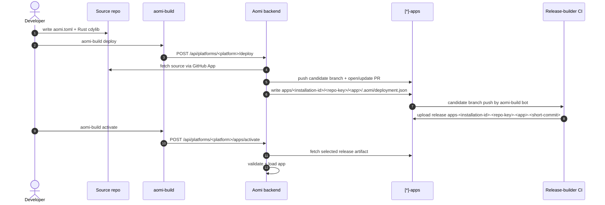

# Launching An Aomi App

This guide describes the flow for a generated `[*]-apps` release-builder repo.
Replace `[*]-apps` with the generated repository name before publishing this
template.

The release-builder repo validates backend-generated deployment records, builds
candidate app artifacts, and publishes GitHub release assets. The backend owns
source fetching, `.aomi/deployment.json`, branch naming, release tag selection,
and activation.



## Prerequisites

- Rust stable matching this repo's workflow toolchain.
- `git` on `PATH`.
- `gh` logged into an account with access to the generated platform repo.
- `aomi-build`, shipped by the SDK.
- A source repository connected through the Aomi GitHub App.
- Backend credentials for real deploy and activation calls.

Install `aomi-build` from the SDK:

```bash
cargo install --git https://github.com/aomi-labs/aomi-sdk --features cli aomi-sdk
```

## 1. Author Your App In A Source Repo

The app source lives outside the `[*]-apps` builder repo. A minimum source repo
looks like:

```
my-app/
|-- aomi.toml
|-- Cargo.toml
|-- .gitignore
`-- src/
    `-- lib.rs
```

Example `aomi.toml`:

```toml
[app]
name         = "my-app"
display_name = "My App"
platform     = "<platform>"
git          = "https://github.com/aomi-labs/[*]-apps"
public       = true
```

Example `Cargo.toml`:

```toml
[package]
name = "my-app"
version = "0.1.0"
edition = "2024"

[lib]
crate-type = ["cdylib"]

[dependencies]
aomi-sdk   = "=3.0.0"
serde      = { version = "1", features = ["derive"] }
serde_json = "1"
```

Pin `aomi-sdk` to the exact `required_sdk_version` in `platform.json`.

## 2. Sanity Check And Dry Run

From the source repo:

```bash
cargo check
cargo test
```

Then dry-run against the target backend:

```bash
AOMI_BACKEND_URL=https://staging-api.aomi.dev \
  AOMI_APP_SOURCE_ID=<app-source-id> \
  aomi-build deploy --platform <platform> --dry-run
```

## 3. Deploy

From the source repo:

```bash
AOMI_BACKEND_URL=https://staging-api.aomi.dev \
  AOMI_APP_SOURCE_ID=<app-source-id> \
  AOMI_APP_ACTIVATION_TOKEN=<platform-or-app-token> \
  aomi-build deploy --platform <platform>
```

The backend deploy handler:

1. Resolves the selected source ref to an exact commit.
2. Fetches source through the GitHub App.
3. Parses requested `aomi.toml` files.
4. Copies app source into `apps/<installation-id>/<repo-key>/<app>/`.
5. Writes `.aomi/deployment.json` from the backend deploy record.
6. Pushes a candidate branch named
   `<source-owner>/<source-repo>/<installation-id>/<short-source-commit>`.
7. Opens or updates a platform PR against `publish`.

Do not hand-edit app directories in `[*]-apps`. Redeploy through the backend so
the manifest, branch, release tag, and file hashes stay consistent.

## 4. Release-Builder CI

The workflow at `.github/workflows/build-candidate.yml` runs when an Aomi build
bot pushes a candidate branch shaped like:

```
<source-owner>/<source-repo>/<installation-id>/<short-source-commit>
```

It uses `publish` as the baseline, detects changed app directories under
`apps/<installation-id>/<repo-key>/<app>/`, validates each
`.aomi/deployment.json`, builds the app, and publishes a release tagged:

```
apps-<installation-id>-<repo-key>-<app>-<short-source-commit>
```

## 5. Activation

Activation is backend-owned. `aomi-build activate` calls:

```
POST /api/platforms/<platform>/apps/activate
```

The backend resolves the requested PR, branch, commit, or release tag, fetches
release assets from the platform repo, validates SDK version, target, and file
hashes, then loads the app.

## Common Errors

| Error | Cause | Fix |
|---|---|---|
| `git tree is dirty` | uncommitted files in your source repo | commit or ignore generated local state such as `.aomi/`, `target/`, and `Cargo.lock` |
| `deploy needs --app-source-id` | the CLI does not know which GitHub App-connected source repo to deploy | pass `--app-source-id` or set `AOMI_APP_SOURCE_ID` |
| `deploy requires an activation token` | the backend deploy endpoint requires platform/app authority | export `AOMI_APP_ACTIVATION_TOKEN` or request one from ops |
| `candidate release workflow must run on ... branches` | candidate branch does not match the backend branch shape | deploy through the backend instead of pushing by hand |
| `candidate app dir must be apps/<installation-id>/<repo-key>/<app>` | staged path does not match the backend contract | redeploy through the backend |
| `deployment manifest release_tag must be ...` | manifest release tag does not match the candidate branch | redeploy through the backend |
| `sdk_version mismatch` | app `aomi-sdk` dependency does not match `platform.json` | pin the exact required SDK version |
