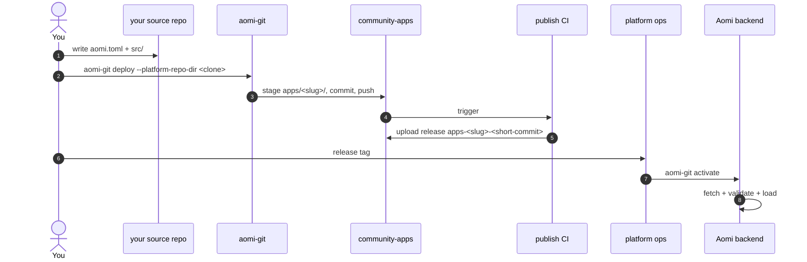

# Launching an Aomi App

End-to-end guide for shipping a new app into community-apps and getting it loaded on the Aomi runtime.

1. **Author** your app in your own source repo: a Rust `cdylib` crate + `aomi.toml`.
2. **Deploy** with `aomi-git deploy` — stages your source into `apps/<slug>/` of a community-apps clone and pushes to `publish`.
3. **CI** builds the cdylib and publishes a GitHub release tagged `apps-<slug>-<short-commit>`.
4. **Activate**: hand the release tag to the platform operator; they run `aomi-git activate` and the backend fetches + loads.



---

## Prerequisites

- **Rust nightly** (the SDK builds on `2024` edition)
- **`gh` (GitHub CLI)** logged into an account with read access to `aomi-labs`
- **`aomi-git`** — the deploy CLI, shipped from the SDK:

  ```bash
  cargo install --git https://github.com/aomi-labs/aomi-sdk --features cli aomi-sdk
  # binary lands at ~/.cargo/bin/aomi-git
  ```

You do NOT need an activation token to contribute. See "Activation" below.

---

## 1. Author your app in a source repo

Your app lives in its own repo, separate from this one. The minimum layout:

```
my-cool-app/
├── aomi.toml
├── Cargo.toml
├── .gitignore       (must include .aomi/ and target/)
└── src/
    └── lib.rs       (#[no_mangle] aomi_plugin_entry via dyn_aomi_app! macro)
```

### `aomi.toml`

```toml
[app]
name         = "my-cool-app"            # slug — kebab-case, becomes the release tag
display_name = "My Cool App"            # human-readable
platform     = "community"              # MUST be "community" for this repo
git          = "https://github.com/aomi-labs/community-apps"
public       = true                     # visible to all backend users

# Optional: pin which class of backend can load this release.
# Omit to default to ["staging"] — your release will only load on staging
# backends. Set to ["prod"] for the production-tier release once tested.
# server_tags = ["staging"]
```

**You don't need `access_token` for community-apps.** This repo is public,
so the backend can fetch your release tarball without auth. Omit the field
entirely.

If you ever publish to a **private** platform repo, you'd add an
`access_token` line pointing at an env var (never a literal token — that's
rejected at parse so committed configs can't leak secrets):

```toml
# only needed for private platform repos — community-apps is public, skip this
access_token = "$MY_GH_TOKEN"   # ✅ env-var ref
access_token = "ghp_xxxxxxx"    # ❌ rejected at parse — never commit secrets
```

### `Cargo.toml`

Pin the SDK to the exact version this repo's CI expects. Check `platform.json`
in this repo for the current `required_sdk_version`:

```toml
[package]
name = "my-cool-app"
version = "0.1.0"
edition = "2024"

[lib]
crate-type = ["cdylib"]

[dependencies]
aomi-sdk   = "=0.1.20"          # match platform.json's required_sdk_version
serde      = { version = "1", features = ["derive"] }
serde_json = "1"
```

> **Heads up:** `aomi-ext` (the optional HMAC / signing helpers) is not yet
> published to crates.io. If you need it, copy the small helpers you use into
> your `src/auth.rs` directly. See `apps/gambit/src/auth.rs` in this repo for
> an example.

### `src/lib.rs`

Register your tools with the `dyn_aomi_app!` macro at the bottom of `lib.rs`.
Look at any existing app under `apps/` for the shape — `apps/fanforge` is the
cleanest reference.

---

## 2. Sanity check: build + dry-run preflight

```bash
# from your source repo:
cargo check                    # ensure your plugin compiles
cargo test                     # if you have any tests
```

Then run the dry-run with online preflight, pointing at staging:

```bash
AOMI_BACKEND_URL=https://staging-api.aomi.dev \
  aomi-git deploy --dry-run --preflight
```

This produces `.aomi/deployment.json` next to your `aomi.toml`. Read it. You
should see all checks pass:

```jsonc
{
  "checks": [
    { "name": "git_clean",                "passed": true },
    { "name": "platform_declared",        "passed": true, "detail": "community" },
    { "name": "git_declared",             "passed": true, "detail": "https://github.com/aomi-labs/community-apps" },
    { "name": "server_tags",              "passed": true, "detail": "defaulted to [staging] (aomi.toml did not declare server_tags)" },
    { "name": "backend_reachable",        "passed": true, "detail": "found 2 platforms" },
    { "name": "platform_resolved",        "passed": true, "detail": "community -> aomi-labs/community-apps" },
    { "name": "branch_matches_contract",  "passed": true, "detail": "publish == publish" },
    { "name": "git_url_matches_platform", "passed": true, "detail": "aomi-labs/community-apps" },
    { "name": "server_tags_match",        "passed": true, "detail": "target [staging] subset of server [staging]" }
  ]
}
```

If any check fails, fix the underlying issue (usually your `aomi.toml`) before
running deploy.

---

## 3. Deploy: stage source into community-apps + push

This is the step where `community-apps` enters the picture. Up to here you've
been working entirely in your own source repo. Now `aomi-git` needs a
**transit clone** of community-apps to stage your files into before pushing.

### Two clones, one writes code, one transits

| Directory | Who edits | What for |
|---|---|---|
| Your source repo | **You.** Write Rust, commit. | Authoring. |
| A local clone of `community-apps` | **`aomi-git` only.** Never hand-edit. | Transit — the CLI copies your source in, commits, pushes. |

```bash
# anywhere on disk — your home dir, ~/code/, /tmp, whatever:
git clone https://github.com/aomi-labs/community-apps
```

Then, from **your source repo**, point the CLI at that clone:

```bash
aomi-git deploy --platform-repo-dir /path/to/community-apps
```

What this does:

1. Snapshots your source tree under `apps/<slug>/` in the community-apps clone
2. Writes `apps/<slug>/.aomi/deployment.json` (the build contract for CI)
3. Commits and pushes to the `publish` branch
4. The community-apps CI auto-fires:
   - validates the staged source against `apps/<slug>/.aomi/deployment.json`
   - runs `cargo build --release` for the cdylib
   - uploads a release tarball under tag `apps-<slug>-<short-source-commit>`

You can watch CI here:
<https://github.com/aomi-labs/community-apps/actions>

> **Auto-activate will 502** if you set `AOMI_APP_ACTIVATION_TOKEN`, because
> the release tarball doesn't exist yet when push completes. That's expected.
> The platform operator will activate once CI has uploaded the release.

---

## 4. Activation

You **don't need the activation token** to contribute. After your CI run is
green and the release tag exists on GitHub, ping the platform operator with:

- the release tag (`apps-<slug>-<short-commit>`)
- the target environment (staging or prod)

They run:

```bash
aomi-git activate apps-<slug>-<short-commit> \
  --backend-url https://staging-api.aomi.dev \
  --source-repo aomi-labs/community-apps \
  --target-tag staging \
  --visibility public
```

…and confirm with you that your app appears in
`https://staging-api.aomi.dev/api/control/apps/status`.

If you *are* the platform operator and have the token in your env as
`AOMI_APP_ACTIVATION_TOKEN`, you can run the activate yourself.

### Why this is the model

- The activation token authorizes `community` writes against the backend.
  Anyone with it can mint or replace ANY community app row. We keep it with
  the platform operator until per-contributor tokens land.
- This repo's CI does not call activate. The PR review and CI run prove your
  release is buildable and well-formed; activation is a separate trust step.

---

## 5. Promoting from staging to prod

Once your app is verified on staging:

1. Edit `aomi.toml`: `server_tags = ["prod"]`
2. Re-run `aomi-git deploy --platform-repo-dir <community-apps>` — this
   creates a new release tag (different source commit) targeting prod
3. Ask the platform operator to activate against `api.aomi.dev` with
   `--target-tag prod`

Until you do this, your app exists in the DB but won't load on prod backends
(by design — see ADR 0010 in aomi-launch-my-agent).

---

## Common errors

| Error | Cause | Fix |
|---|---|---|
| `git tree is dirty` | uncommitted files in your source repo (often `.aomi/deployment.json` from a previous dry-run) | commit, or add `.aomi/` and `target/` to `.gitignore` |
| `aomi.toml [app].access_token must be \`$ENV_VAR_NAME\`` | you put a literal token in `aomi.toml` | use `"$ENV_VAR_NAME"`; never commit secrets |
| `dirty files outside owned publish path` | your community-apps clone has uncommitted changes to files NOT under `apps/<slug>/` | `git -C /path/to/community-apps stash` |
| `activation endpoint ... returned 409 Conflict` | your `target_tags` aren't a subset of the backend's `AOMI_SERVER_TAGS` | match your env to the backend you're activating against |
| `activation endpoint ... returned 502 Bad Gateway` | release tarball doesn't exist yet (CI race) or backend can't reach GitHub | retry after CI finishes |
| `sdk_version mismatch` | your `aomi-sdk` Cargo dep doesn't match `platform.json`'s `required_sdk_version` | pin `aomi-sdk = "=0.1.X"` to the right version |

## Quick reference

| Where | What |
|---|---|
| `https://staging-api.aomi.dev` | staging backend — first stop for any new app |
| `https://api.aomi.dev` | production backend — after staging is green |
| `/api/control/platforms` | what platforms (`community`, `krexa`, …) the backend recognizes |
| `/api/control/server-tags` | what server tags the backend matches (`[staging]` vs `[prod]`) |
| `/api/control/apps/status` | full registry — your app should show `loaded: true` after activation |
| `platform.json` | CI contract — `required_sdk_version`, `release_tag_convention`, etc. |

For the contract behind all of this, see ADR 0004, 0009, and 0010 in the
[aomi-launch-my-agent](https://github.com/aomi-labs/aomi-launch-my-agent)
repo.
