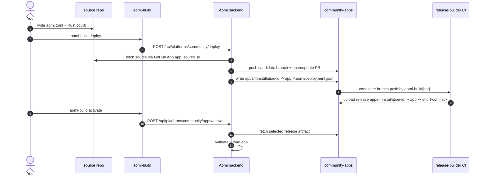

# Launching an Aomi App

End-to-end guide for shipping a new app through `community-apps` and getting it
loaded on the Aomi runtime.

`community-apps` is a release builder. The backend owns deployment records,
`.aomi/deployment.json`, build targeting, and activation. This repo validates
the backend-generated record and publishes candidate release artifacts.

1. **Author** your app in your own source repo: a Rust `cdylib` crate plus
   `aomi.toml`.
2. **Deploy** with `aomi-build deploy`. The CLI sends a source-bound request to
   the backend.
3. **Backend staging** fetches your source through the GitHub App, writes
   `apps/<installation-id>/<app>/.aomi/deployment.json`, and opens or updates a
   platform PR.
4. **Release-builder CI** runs on the backend candidate branch, validates the
   backend manifest, builds the cdylib, and publishes a GitHub release tagged
   `apps-<installation-id>-<app>-<short-source-commit>`.
5. **Activation** calls the backend. The backend resolves the requested PR,
   branch, commit, or release tags against its deployment record and fetches the
   desired artifacts.



---

## Prerequisites

- **Rust stable** matching this repo's workflow toolchain.
- **`git`** on `PATH`.
- **`gh` (GitHub CLI)** logged into an account with read access to `aomi-labs`.
  It is useful for watching PRs, workflow runs, and releases directly.
- **`aomi-build`**, shipped from the SDK:

  ```bash
  cargo install --git https://github.com/aomi-labs/aomi-sdk --features cli aomi-sdk
  # binary lands at ~/.cargo/bin/aomi-build
  ```
- **Connected source repo**. Install the Aomi GitHub App on your source repo
  and get the resulting `app_source_id`. `aomi-build deploy` sends this id to
  the backend with `--app-source-id` or `AOMI_APP_SOURCE_ID`.
- **Backend credentials**. Real deploy and activate calls need a backend URL
  and activation token. Use `aomi-build request` if you need ops to issue one.

You can still run an offline dry-run without credentials; the real backend
deploy requires the credentials above.

---

## 1. Author your app in a source repo

Your app lives in its own repo, separate from this one. The minimum layout:

```
my-cool-app/
|-- aomi.toml
|-- Cargo.toml
|-- .gitignore       (must include .aomi/, target/, and Cargo.lock)
`-- src/
    `-- lib.rs       (#[no_mangle] aomi_plugin_entry via dyn_aomi_app! macro)
```

### `aomi.toml`

```toml
[app]
name         = "my-cool-app"            # slug used under apps/<installation-id>/
display_name = "My Cool App"            # human-readable
platform     = "community"              # must be "community" for this repo
git          = "https://github.com/aomi-labs/community-apps"
public       = true                     # visible to all backend users

# Optional: pin which class of backend can load this release.
# Omit to default to ["staging"].
# server_tags = ["staging"]
```

#### Source access

Do not put GitHub tokens in `aomi.toml`. Hosted deploys are source-bound:

- The Aomi GitHub App installation creates an `app_source` row for your source
  repo.
- `aomi-build deploy --app-source-id <id>` tells the backend which connected
  source to read.
- The backend mints short-lived GitHub App tokens server-side for source reads
  and platform writes.

For community apps, `aomi.toml` describes the app and target platform; source
repo credentials stay outside the app manifest.

### `Cargo.toml`

Pin the SDK to the exact version this repo's CI expects. Check `platform.json`
in this repo for the current `required_sdk_version`:

```toml
[package]
name = "my-cool-app"
version = "0.1.0"
edition = "2024"

[lib]
crate-type = ["cdylib"]

[dependencies]
aomi-sdk   = "=3.0.0"          # match platform.json's required_sdk_version
serde      = { version = "1", features = ["derive"] }
serde_json = "1"
```

### `src/lib.rs`

Register your tools with the `dyn_aomi_app!` macro at the bottom of `lib.rs`.
Look at an existing app under `apps/` for the shape.

---

## 2. Sanity check: build + dry-run

```bash
# from your source repo:
cargo check
cargo test
```

Then dry-run against staging:

```bash
AOMI_BACKEND_URL=https://staging-api.aomi.dev \
  AOMI_APP_SOURCE_ID=<your-app-source-id> \
  aomi-build deploy --platform community --dry-run
```

With backend credentials, dry-run posts `dry_run: true` to the backend and
validates source resolution, archive fetch, `aomi.toml` parsing, and backend
manifest generation without committing this platform repo. Without credentials
it prints the request it would send.

If any stage fails, fix the underlying issue before running deploy. Warnings
are advisory unless the backend rejects the request.

---

## 3. Deploy

From your source repo:

```bash
aomi-build deploy
```

For explicit, repeatable CI/local usage:

```bash
AOMI_BACKEND_URL=https://staging-api.aomi.dev \
  AOMI_APP_SOURCE_ID=<your-app-source-id> \
  AOMI_APP_ACTIVATION_TOKEN=<platform-or-app-token> \
  aomi-build deploy --platform community
```

`aomi-build` does not clone `community-apps`, write `deployment.json`, or push
to `publish`. It sends the repo-scoped deploy request to the backend.

The backend deploy handler does the platform work:

1. Resolves the selected source ref to an exact commit.
2. Fetches the source repo archive through the GitHub App.
3. Parses each requested `aomi.toml`.
4. Copies app source into `apps/<installation-id>/<app>/`.
5. Generates `apps/<installation-id>/<app>/.aomi/deployment.json` from the
   backend deploy record.
6. Pushes a candidate branch named
   `<source-owner>/<source-repo>/<installation-id>/<short-source-commit>`.
7. Opens or updates a platform PR against `publish`.

The generated `deployment.json` records the backend's view of the release:
app metadata, source repository, source commit, platform, staged app path,
release tag, build target, and file hashes. CI validates this file, but the
backend owns it.

---

## 4. Release-builder CI

The workflow at
[`.github/workflows/build-candidate.yml`](./.github/workflows/build-candidate.yml)
runs when `aomi-build[bot]` pushes a candidate branch shaped like:

```
<source-owner>/<source-repo>/<installation-id>/<short-source-commit>
```

It uses `publish` as the baseline, detects changed app directories under
`apps/<installation-id>/<app>/`, and validates each backend-generated
`.aomi/deployment.json`.

For each valid app, CI:

1. Confirms the staged app path matches `apps/<installation-id>/<app>`.
2. Confirms the app record release tag matches
   `apps-<installation-id>-<app>-<short-source-commit>`.
3. Confirms source commit, repository, platform, target triple, file hashes,
   and file byte counts.
4. Builds the app as a Rust `cdylib`.
5. Uploads:
   - `aomi-plugins-<release-tag>-<target>.tar.gz`
   - `manifest.json`
   - `aomi-release.json`

This repo builds and publishes artifacts. It does not decide which artifacts
are activated.

You can watch CI here:
<https://github.com/aomi-labs/community-apps/actions>

---

## 5. Activation

Activation is backend-owned. The activation endpoint is:

```
POST /api/platforms/:platform/apps/activate
```

`aomi-build activate` calls that endpoint. Depending on the request, the
backend can resolve one of these target types:

- `platform_pr`
- `platform_branch`
- `platform_commit`
- `release_tags`

For PR or branch activation, the backend verifies the platform target, checks
CI state, can fast-forward the live branch when required, and derives app paths
and release tags from the backend candidate branch:

```
apps/<installation-id>/<app>
apps-<installation-id>-<app>-<short-source-commit>
```

For commit or explicit release-tag activation, the release tags must be
provided or derivable from the backend activation target.

Once the release tag is resolved, the backend fetches the selected GitHub
release artifact, validates it against the expected SDK version, target, and
hashes, then loads the app. `community-apps` is only the artifact builder and
artifact host; it is not the activation state source of truth.

### When is CI done?

Run `aomi-build status` from your source repo. It reports the backend deploy
state plus GitHub CI/release status for the release tag:

```
$ aomi-build status
Publication status
  repo          : aomi-labs/community-apps
  release_tag   : apps-123456-my-bot-abc1234
  branch        : owner/repo/123456/abc1234
  local state   : deployed=true activated=false
  ci            : running - build-candidate
  release       : pending (not built yet)
```

When CI is green and the release exists, request activation.

### Requesting onboarding + activation

Use `aomi-build request` to ask ops for source access or an activation token:

```bash
aomi-build request --email you@example.com --git-account your-gh-handle
```

Preview without posting:

```bash
aomi-build request --email you@example.com --git-account your-gh-handle --dry-run
```

An ops member grants access or issues a scoped activation token out-of-band.
The token is never part of the request.

### Operator activation

From the source repo, after the candidate release exists:

```bash
AOMI_APP_ACTIVATION_TOKEN=<the scoped activation token> \
AOMI_BACKEND_URL=https://staging-api.aomi.dev \
  aomi-build activate
```

If activating from a fresh machine or an older release, pass the target
explicitly:

```bash
aomi-build activate apps-123456-my-cool-app-abc1234 \
  --backend https://staging-api.aomi.dev \
  --platform community \
  --release-tag apps-123456-my-cool-app-abc1234 \
  --target-tag staging
```

Confirm with:

```bash
aomi-build status --backend https://staging-api.aomi.dev
```

---

## 6. Target tags

`aomi.toml [app].server_tags` is the build's declared scope: the set of backend
tiers the contributor signed off on shipping to. The backend copies this into
the generated `deployment.json`, where it travels with the release.

At activate time the operator can narrow but cannot widen:

- If you declared `server_tags = ["staging"]`, activation to prod is rejected.
- If you declared `server_tags = ["staging", "prod"]`, ops can activate either
  or both.

Promoting from staging to prod requires a new source commit and deploy if the
original build did not include prod in `server_tags`.

---

## Common errors

| Error | Cause | Fix |
|---|---|---|
| `git tree is dirty` | uncommitted files in your source repo | commit or ignore generated local state such as `.aomi/`, `target/`, and `Cargo.lock` |
| `deploy needs --app-source-id` | the CLI does not know which GitHub App-connected source repo to deploy | pass `--app-source-id` or set `AOMI_APP_SOURCE_ID` |
| `deploy requires an activation token` | the backend deploy endpoint requires platform/app authority | export `AOMI_APP_ACTIVATION_TOKEN` or request one from ops |
| `candidate release workflow must run on ... branches` | candidate branch does not match the backend branch shape | deploy through the backend instead of pushing by hand |
| `candidate app dir must be apps/<installation-id>/<app>` | staged path does not match the backend contract | redeploy through the backend |
| `deployment manifest release_tag must be ...` | manifest release tag does not match the candidate branch | redeploy through the backend |
| `sdk_version mismatch` | your `aomi-sdk` Cargo dep does not match `platform.json`'s `required_sdk_version` | pin the exact SDK version required by `platform.json` |
| `... returned 502` | release tarball does not exist yet or the backend cannot reach GitHub | retry after CI finishes |

## Quick reference

| Where | What |
|---|---|
| `https://staging-api.aomi.dev` | staging backend |
| `https://api.aomi.dev` | production backend |
| `/api/platforms` | platforms the backend recognizes |
| `/api/platforms/server-tags` | server tags the backend matches |
| `POST /api/platforms/:platform/deploy` | backend-owned source fetch, staging, and manifest generation |
| `POST /api/platforms/:platform/apps/activate` | backend-owned artifact resolution and activation |
| `aomi-build status` | deploy state plus CI/release status |
| `platform.json` | static release-builder config |

For the contract behind all of this, see ADR 0004, 0009, and 0010 in the
[aomi-launch-my-agent](https://github.com/aomi-labs/aomi-launch-my-agent)
repo.
