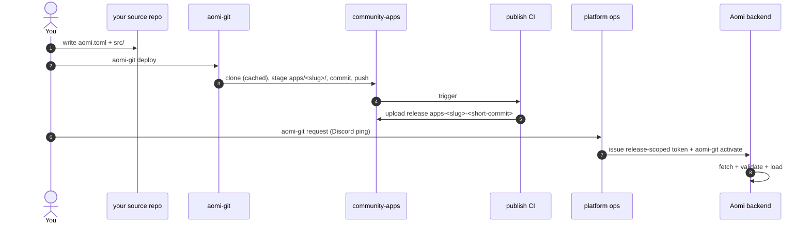

# Launching an Aomi App

End-to-end guide for shipping a new app into community-apps and getting it loaded on the Aomi runtime.

1. **Author** your app in your own source repo: a Rust `cdylib` crate + `aomi.toml`.
2. **Deploy** with `aomi-git deploy` — stages your source into `apps/<slug>/` of a community-apps clone and pushes to `publish`.
3. **CI** builds the cdylib and publishes a GitHub release tagged `apps-<slug>-<short-commit>`.
4. **Request onboarding + activation** with `aomi-git request` — it posts your GitHub account, app, and email to the ops Discord channel and pings ops. Ops grant repo access (if needed) and issue you a release-scoped activation token; once CI's release exists, `aomi-git activate` fetches + loads it.



---

## Prerequisites

- **Rust nightly** (the SDK builds on `2024` edition)
- **`git`** on `PATH` — `aomi-git` shells out to it for the transit clone
- **`gh` (GitHub CLI)** logged into an account with read access to `aomi-labs`.
  Used implicitly: `git`'s credential helper picks up the `gh auth` token when
  cloning the public platform repo.
- **`aomi-git`** — the deploy CLI, shipped from the SDK:

  ```bash
  cargo install --git https://github.com/aomi-labs/aomi-sdk --features cli aomi-sdk
  # binary lands at ~/.cargo/bin/aomi-git
  ```

You do NOT need an activation token to contribute. See "Activation" below.

---

## 1. Author your app in a source repo

Your app lives in its own repo, separate from this one. The minimum layout:

```
my-cool-app/
├── aomi.toml
├── Cargo.toml
├── .gitignore       (must include .aomi/, target/, and Cargo.lock)
└── src/
    └── lib.rs       (#[no_mangle] aomi_plugin_entry via dyn_aomi_app! macro)
```

### `aomi.toml`

```toml
[app]
name         = "my-cool-app"            # slug — kebab-case, becomes the release tag
display_name = "My Cool App"            # human-readable
platform     = "community"              # MUST be "community" for this repo
git          = "https://github.com/aomi-labs/community-apps"
public       = true                     # visible to all backend users

# Optional: pin which class of backend can load this release.
# Omit to default to ["staging"] — your release will only load on staging
# backends. Set to ["prod"] for the production-tier release once tested.
# server_tags = ["staging"]
```

#### About `access_token`

`aomi-git` works by pushing your code into a managed platform repository under
the `aomi-labs` GitHub org (`community-apps` for this platform; other
platforms have their own repos). At activation time, the Aomi backend
**fetches your release tarball from that platform repo on GitHub**. So
whether you need an `access_token` depends on one question: is the platform
repo public or private?

- **community-apps is public.** The backend can fetch your release tarball
  from `github.com/aomi-labs/community-apps/releases` anonymously. **Omit the
  `access_token` field entirely** — you don't need one to publish here.
- **Private platform repos** (e.g. `krexa-hosted-apps`) require a GitHub PAT
  with read access to releases. You declare it in `aomi.toml` as a reference
  to an env var — never the token itself. Literal tokens are rejected at
  parse so a committed config can never leak a secret:

  ```toml
  # only needed for private platform repos — community-apps is public, skip this
  access_token = "$MY_GH_TOKEN"   # ✅ env-var ref — resolved at deploy time
  access_token = "ghp_xxxxxxx"    # ❌ rejected at parse — never commit secrets
  ```

  Per [ADR 0009 amended](https://github.com/aomi-labs/aomi-launch-my-agent),
  the token is **transient**: passed once in the activation request body,
  used once by the backend to download the tarball, never persisted, never
  logged, never written to disk.

### `Cargo.toml`

Pin the SDK to the exact version this repo's CI expects. Check `platform.json`
in this repo for the current `required_sdk_version`:

```toml
[package]
name = "my-cool-app"
version = "0.1.0"
edition = "2024"

[lib]
crate-type = ["cdylib"]

[dependencies]
aomi-sdk   = "=0.1.21"          # match platform.json's required_sdk_version
serde      = { version = "1", features = ["derive"] }
serde_json = "1"
```

> **Heads up:** `aomi-ext` (the optional HMAC / signing helpers) is not yet
> published to crates.io. If you need it, copy the small helpers you use into
> your `src/auth.rs` directly. See `apps/gambit/src/auth.rs` in this repo for
> an example.

### `src/lib.rs`

Register your tools with the `dyn_aomi_app!` macro at the bottom of `lib.rs`.
Look at any existing app under `apps/` for the shape — `apps/fanforge` is the
cleanest reference.

---

## 2. Sanity check: build + dry-run

```bash
# from your source repo:
cargo check                    # ensure your plugin compiles
cargo test                     # if you have any tests
```

Then dry-run against staging. Dry-run does the offline plan **and** the online
preflight (backend reachability, branch contract, server-tag subset check) —
it's the single "show me what would happen" command:

```bash
AOMI_BACKEND_URL=https://staging-api.aomi.dev \
  aomi-git deploy --dry-run
```

You should see all four pipeline stages pass:

```text
Preflight
  [ok]   workspace git_clean
  [ok]   manifest  platform_declared, git_declared  ·  defaulted=true server_tags=[staging]
  [ok]   platform  platform_resolved, branch_matches_contract, git_url_matches_platform  ·  deployment_branch=publish github_repo=aomi-labs/community-apps name=community
  [ok]   backend   backend_reachable, server_tags_match
```

The same plan also lands in `.aomi/deployment.json` next to your `aomi.toml`
(read it if you need machine-readable detail or want to inspect resolved
facts).

If any stage fails, fix the underlying issue (usually your `aomi.toml`)
before running deploy. Warnings (`[warn]`) are advisory and don't block —
a common one is `git_url_matches_platform` when you're deploying from a fork.

---

## 3. Deploy

From your source repo:

```bash
aomi-git deploy
```

That's it. `aomi-git` manages a transit clone of `community-apps` for you
under `~/.aomi/transit/aomi-labs-community-apps/` (you never touch it — it's a
CLI-managed cache). On first deploy it clones; on subsequent deploys it
fetches and resets. Auth flows through your normal `git` credential helper, so
if `gh auth login` works, this works.

What this does:

1. Snapshots your source tree into the transit clone under `apps/<slug>/`
2. Writes `apps/<slug>/.aomi/deployment.json` (the build contract for CI)
3. Commits and pushes to the `publish` branch
4. The community-apps CI auto-fires:
   - validates the staged source against `apps/<slug>/.aomi/deployment.json`
   - runs `cargo build --release` for the cdylib
   - uploads a release tarball under tag `apps-<slug>-<short-source-commit>`

You can watch CI here:
<https://github.com/aomi-labs/community-apps/actions>

> **`deploy` does not activate.** It only pushes source and triggers CI.
> Activation is a separate step that must run *after* CI uploads the release —
> so the platform operator (or you, once you hold a token) runs `aomi-git
> activate` once the release tag exists. Setting `AOMI_APP_ACTIVATION_TOKEN`
> alone no longer triggers activation on `deploy`; pass `aomi-git deploy
> --activate` to explicitly chain it (only useful when the release already
> exists).

### Escape hatch: `--platform-dir`

If you need to manage the clone yourself (air-gapped CI, custom auth, or
debugging the staged tree before push), pass a directory you control:

```bash
aomi-git deploy --platform-dir /path/to/your/community-apps-clone
```

This skips the transit cache entirely. You're responsible for keeping that
clone in sync with `origin/publish`. Most contributors should never need this.

---

## 4. Activation

You **don't need the activation token** to contribute. Once your CI run is
green and the release tag exists on GitHub, hand off to the platform
operator.

### When is CI done?

Run `aomi-git status` from your source repo. It reads your
`.aomi/deployment.json` and polls GitHub for you, reporting both signals in
one place:

```
$ aomi-git status
Publication status
  repo          : aomi-labs/community-apps
  release_tag   : apps-my-bot-abc1234
  branch        : publish
  local state   : pushed=true deployed=true activated=false
  ci            : ⏳ running — publish-apps
                  https://github.com/aomi-labs/community-apps/actions/runs/...
  release       : pending (not built yet)
```

When `ci` is green and `release` shows **✓ published … ready to activate**,
you're ready to request activation. (`aomi-git status apps-<slug>-<commit>`
checks a specific tag; otherwise it uses the latest deploy's tag.)

You can still watch the underlying pages directly if you prefer —
`https://github.com/aomi-labs/community-apps/actions` for CI and
`.../releases/tag/apps-<slug>-<short-commit>` for the release — but
`aomi-git status` rolls both up.

### Requesting onboarding + activation

You don't DM ops manually — `aomi-git request` posts the ask for you. Run it
once to get repo access and an activation token (you can do this even before
your first deploy):

```bash
aomi-git request --email you@example.com --git-account your-gh-handle
```

This posts an **onboarding/activation request** — your GitHub account, app, and
email — into the `✅-activation-requests` Discord channel, pinging the **@ops**
role, so asks land in one place instead of scattered DMs. Preview it first
without posting:

```bash
aomi-git request --email you@example.com --git-account your-gh-handle --dry-run
```

An `@ops` member grants your GitHub account access to the platform repo (if
needed) and issues you a release-scoped activation token out-of-band — the
token is **never** part of the request. Once your CI release exists, ops (or
you, with the token) run `aomi-git activate`, then confirm your app at
`https://staging-api.aomi.dev/api/control/apps/status`.

### If you are the operator yourself

Mint a release-pinned token for the tag (ops side: `POST
/api/admin/platforms/community/activation-tokens` with the release tag, or the
equivalent admin CLI), export it, and run from the source repo:

```bash
AOMI_APP_ACTIVATION_TOKEN=<the scoped activation token> \
AOMI_BACKEND_URL=https://staging-api.aomi.dev \
  aomi-git activate
```

That's the whole command. `aomi-git activate` reads `.aomi/deployment.json`
(left there by `aomi-git deploy`) and pulls release tag, platform, source
repo, source provenance, display name, visibility, **and target tags** from
it. The target tags come from the build's `server_tags` (see "How target tags
work" below) — you don't normally pass `--target-tag` at all.

For activations that can't see the source repo's `deployment.json` (e.g.
re-activating an older release tag, or running from a fresh machine), every
field can be passed explicitly:

```bash
aomi-git activate apps-<slug>-<short-commit> \
  --backend https://staging-api.aomi.dev \
  --platform community \
  --source-repo aomi-labs/community-apps \
  --target-tag staging \
  --visibility public
```

…and confirm with you that your app appears in
`https://staging-api.aomi.dev/api/control/apps/status`.

### How target tags work

`aomi.toml [app].server_tags` is the **build's declared scope** — the set of
backend tiers the contributor signed off on shipping to. `aomi-git deploy`
copies this into `.aomi/deployment.json`, where it travels with the release.

At activate time the operator can **narrow** but cannot **widen**:

- If you declared `server_tags = ["staging"]` in aomi.toml, the operator can
  only activate to staging. An attempt to widen to prod is rejected with a
  multi-line error pointing back at the source repo.
- If you declared `server_tags = ["staging", "prod"]`, the operator can
  activate to either (or both). They'll typically start with `--target-tag
  staging`, verify, then re-run with `--target-tag prod`.

This makes the contributor's word at build time a contract, not advisory. If
you want your app on prod, you have to say so in your aomi.toml first — no
operator can do it for you.

### Why activation is held by `@ops`, not contributors

- Activating writes to the backend's `community` app registry. Ops hold the
  tokens; you request one with `aomi-git request`.
- Ops now mint a **per-contributor token pinned to your release tag** — it can
  only activate that one release, so even if it leaked it couldn't touch any
  other app. (A single shared master used to gate all of `community`; it still
  works as a fallback, but new requests get a scoped token.)
- This repo's CI does not call activate. The PR review and CI run prove your
  release is buildable and well-formed; activation is a separate trust step.

---

## 5. Promoting from staging to prod

Once your app is verified on staging:

1. Edit `aomi.toml`: change `server_tags = ["staging"]` to either
   `["prod"]` (prod-only) or `["staging", "prod"]` (both tiers loadable
   from this release).
2. Re-run `aomi-git deploy` — this creates a new release tag (different
   source commit) carrying the wider declared scope.
3. Ask ops to activate the new release on prod — or run `aomi-git activate
   --target-tag prod` yourself if you hold a token for it — against
   `https://api.aomi.dev`. Per the target-tag rule the wider scope must come
   from this re-deploy; ops can't widen it on your behalf.

Why the re-deploy? Per the target-tag rule, the operator can only activate
to scopes the build itself declared in `aomi.toml`. Promoting to prod
requires you (the contributor) to re-deploy with prod in `server_tags`
first — the operator can't widen the scope on your behalf. By design — see
ADR 0010 in aomi-launch-my-agent.

---

## Common errors

| Error | Cause | Fix |
|---|---|---|
| `git tree is dirty` | uncommitted files in your source repo (often `.aomi/deployment.json` from a previous dry-run) | commit, or add `.aomi/`, `target/`, and `Cargo.lock` to `.gitignore` |
| `aomi.toml [app].access_token must be \`$ENV_VAR_NAME\`` | you put a literal token in `aomi.toml` | use `"$ENV_VAR_NAME"`; never commit secrets |
| `git clone ... exited 128` | `aomi-git` couldn't fetch the platform repo into its transit cache (auth or network) | `gh auth login`; if still wedged, `rm -rf ~/.aomi/transit/aomi-labs-community-apps/` and retry |
| `failed to refresh transit clone` | transit cache got into a weird state (interrupted clone, manual edits) | `rm -rf ~/.aomi/transit/aomi-labs-community-apps/` and re-run `aomi-git deploy` |
| `... returned 409` — `collides with an already-installed plugin` | another app already uses your plugin **name** on the backend (the runtime plugin namespace is global today) | rename your app/plugin and re-deploy |
| `... returned 409` — target tags | your `target_tags` aren't a subset of the backend's `AOMI_SERVER_TAGS` | match your env to the backend you're activating against |
| `... returned 422` — `incompatible` / `rebuild` | the built bundle is invalid for this backend (e.g. an SDK mismatch baked into the release) | rebuild against the right `required_sdk_version` and re-deploy |
| `... returned 502` | release tarball doesn't exist yet (CI race) or the backend can't reach GitHub | retry after CI finishes |
| `sdk_version mismatch` | your `aomi-sdk` Cargo dep doesn't match `platform.json`'s `required_sdk_version` | pin `aomi-sdk = "=0.1.21"` to the right version |

## Quick reference

| Where | What |
|---|---|
| `https://staging-api.aomi.dev` | staging backend — first stop for any new app |
| `https://api.aomi.dev` | production backend — after staging is green |
| `/api/control/platforms` | what platforms (`community`, `krexa`, …) the backend recognizes |
| `/api/control/server-tags` | what server tags the backend matches (`[staging]` vs `[prod]`) |
| `/api/control/apps/status` | full registry — your app should show `loaded: true` after activation |
| `platform.json` | CI contract — `required_sdk_version`, `release_tag_convention`, etc. |

For the contract behind all of this, see ADR 0004, 0009, and 0010 in the
[aomi-launch-my-agent](https://github.com/aomi-labs/aomi-launch-my-agent)
repo.
